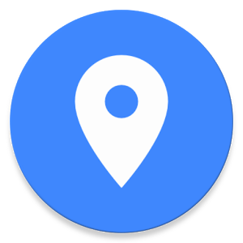

# Awesome Places

* One, taking pictures of the places you like.
* Two, marking the location or locating yourself.
* Three, sharing it with everyone!

This is a React Native app, so it can be built for both Android and iOS. :)

Currently available on the Play Store.

## Technologies used:

- React Native + Redux
- Language: JSX (JavaScript)
- Database: Firebase Realtime Database
- API: Google Map API

## Acknowledgements

* Some parts of this application were inspired by the course of [React Native - The Practical Guide](https://www.udemy.com/react-native-the-practical-guide/) by *Maximilian Schwarzmüller*.
